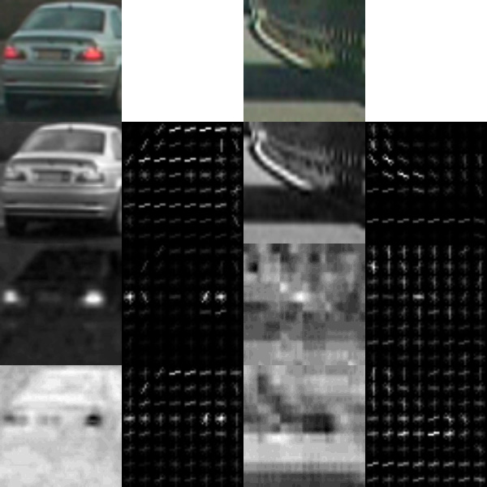
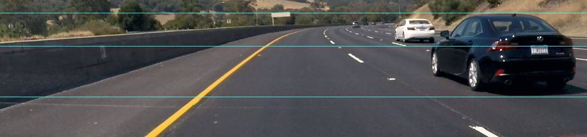
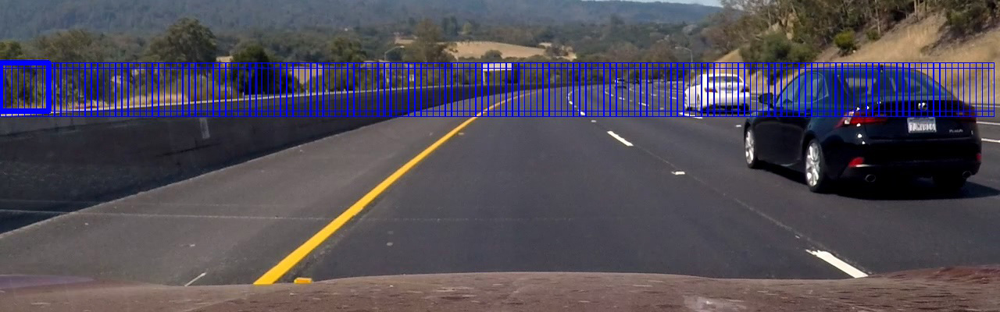
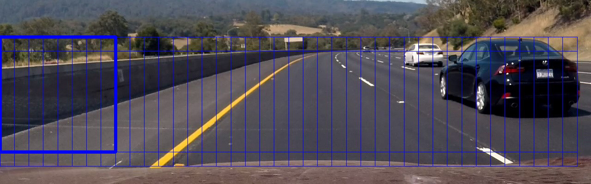
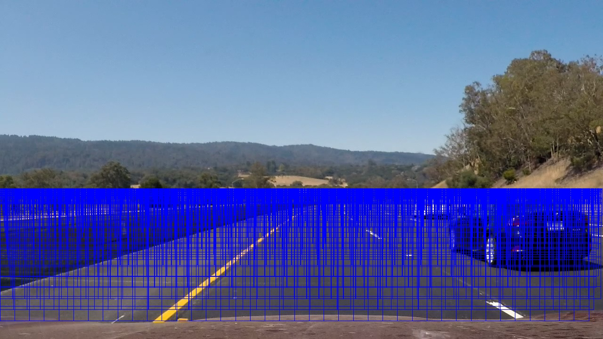
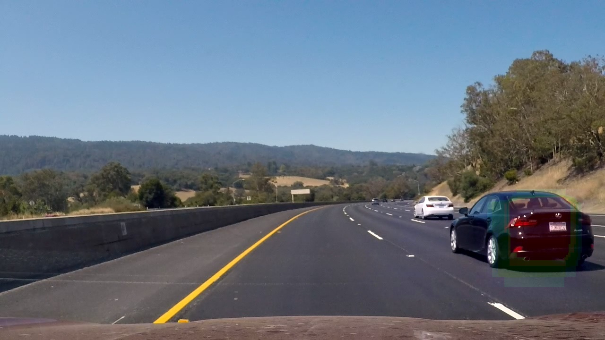
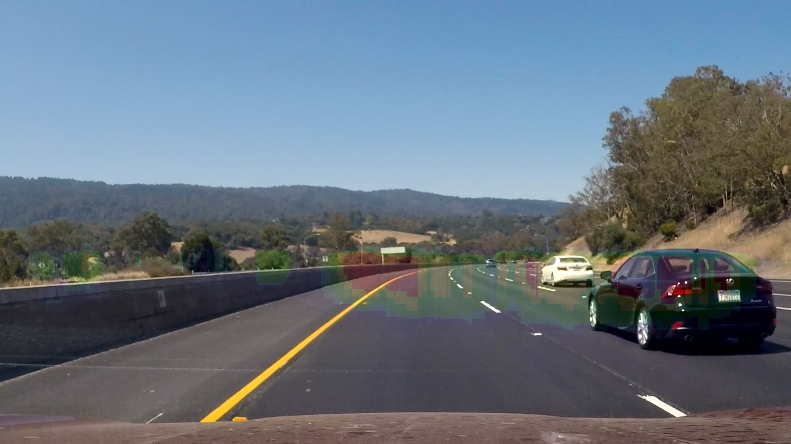
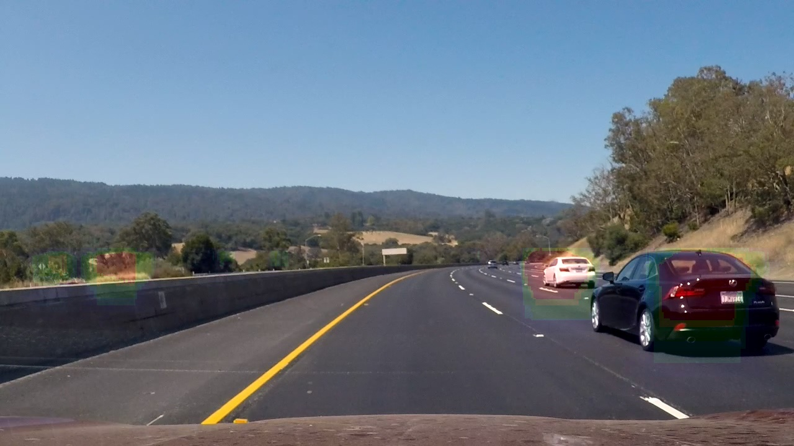

# **Vehicle Tracking Project**

## Introduction

This project aims to implement a vehicle detection and tracking pipeline based on 
traditional machine learning method. A linear support vector machine (SVM) was trained
with [GTI vehicle image database](https://www.gti.ssr.upm.es/data/Vehicle_database.html)
and vehicle images extracted from [KITTI Vision Benchmark Suite](http://www.cvlibs.net/datasets/kitti/).

The steps of this project are the following:

* Perform a Histogram of Oriented Gradients (HOG) feature extraction on a labeled training set of images and train a classifier Linear SVM classifier
* Implement a sliding-window technique and use trained classifier to search for vehicles in images.
* Test pipeline on a video stream and estimate a bounding box for vehicles detected.

## Video

[](https://www.youtube.com/watch?v=l3lIVtXIZcM)

## Feature extraction

### Histogram of Oriented Gradients (HOG) feature

In computer vision, HOG feature was a state-of-the-art and very popular feature descriptor 
before deep neural network. In CVPR 2005, Dalal et al. presented their pedestrian detection 
pipeline combining HOG feature and linear SVM in [this paper](https://lear.inrialpes.fr/people/triggs/pubs/Dalal-cvpr05.pdf).

The HOG feature can be extracted by this code.
```python
from skimage.feature import hog

hog_features_param = {'orient': 9,
                      'pix_per_cell': 8,
                      'cell_per_block': 2}

# Define a function to return HOG features and visualization
def get_hog_features(img, 
                     orient,
                     pix_per_cell, 
                     cell_per_block,
                     vis=False, 
                     feature_vec=True):
					 
    # Call with two outputs if vis==True
    if vis == True:
        features, hog_image = hog(img, orientations=orient, pixels_per_cell=(pix_per_cell, pix_per_cell),
                                  cells_per_block=(cell_per_block, cell_per_block), transform_sqrt=True,
                                  visualise=vis, feature_vector=feature_vec)
        return features, hog_image
    # Otherwise call with one output
    else:
        features = hog(img, orientations=orient, pixels_per_cell=(pix_per_cell, pix_per_cell),
                       cells_per_block=(cell_per_block, cell_per_block), transform_sqrt=True,
                       visualise=vis, feature_vector=feature_vec)
        return features
```

For simplicity reason, I used the HOG parameters proposed from the original pedestrian detection paper 
and the results proved that it also works well for vehicle detection. As purposed in the original paper,
the missing rate of detection could be further improved by performing the parameter tuning (cell size and block size) 
as following figure shown.


After explored different color spaces and hyperparameters, I decided to use YCrCb color space. The car geometry in Y space 
and tail light in Cr, Cb space is a very good feature to distinguish vehicle from the background.

Here is an example of the hog feature extracted in YCrCb color space from one car image and one non-car image. 	
	

## Classifier traning

Then I loaded all extracted features into memory and trained three classifiers. One is linear SVM which is used in the pedestrain detection paper.
Others are Gradient Boosting Decision Tree (GBDT) and Random Forest (RF), they are very popular classifiers in Kaggle competition. For simplicity reason, 
all classifier use default parameters in scikit-learn.

```python
# Load features
X_train = pickle.load(open("X_train.p", "rb"))
y_train = pickle.load(open("y_train.p", "rb"))
X_test = pickle.load(open("X_test.p", "rb"))
y_test = pickle.load(open("y_test.p", "rb"))

clf = LinearSVC()
# clf = GradientBoostingClassifier()
# clf = RandomForestClassifier()

clf.fit(X_train, y_train)

pickle.dump(clf, open("classifier.p", "wb"), protocol=4)
```

Linear SVM performs best among three classifier with default parameters.

| Classifier                       | Validation Accuracy | 
|:--------------------------------:|:-------------------:|
| Linear SVM                       | 98.17 %             |
| Gradient Boosting Decision Tree  | 94.56 %             |
| Random Forest                    | 97.23 %             |

Linear SVM performs best based on the detection accuracy on validation set.

## Vehicle detection with sliding window search on single image

To detect the vehicle position on a single image, sliding window search method was used. A window sliding on the image and crop image into multiple areas. 
The trained classifier determine whether each area contains vehicle.

The number of sliding windows can be reduced by only scaning road surface.	
	

Here is the visualization of sliding windows.

	



All three classifier were tested and here are the visualization of their heatmaps.	
*Gradient Boosting Decision Tree (GBDT)*

*Random Forest (RF)*	

*Linear SVM*


The Random Forest classifier generates too much false positives 
so I decided not to use it in this project.

GBDT generates very few false positives on all seven test images. 
It's reasonable since it is a boosting model which focus on reduce model bias.
However, it performs weakly on the detection of white vehicle in the video. 
This could be a sign of overfitting so we could try to apply regularization technique 
or reduce the number of boosting iterations

Linear SVM generates false positives but provide strong detection on all vehicles.
And it requires least computational cost among all three models.

Therefore, I choose Linear SVM to be the classifier in the video pipeline, and try to suppress 
error detection by combining multiple frames.

In the end, draw bounding box of vehicles based on the heatmap.

```python
def draw_labeled_bboxes(img, labels):
    # Iterate through all detected cars
    for car_number in range(1, labels[1]+1):
        # Find pixels with each car_number label value
        nonzero = (labels[0] == car_number).nonzero()
        # Identify x and y values of those pixels
        nonzeroy = np.array(nonzero[0])
        nonzerox = np.array(nonzero[1])
        # Define a bounding box based on min/max x and y
        bbox = ((np.min(nonzerox), np.min(nonzeroy)), (np.max(nonzerox), np.max(nonzeroy)))
        # Draw the box on the image
        cv2.rectangle(img, bbox[0], bbox[1], (0,0,255), 6)
    # Return the image
    return img
```

## Vehicle detection and tracking on video

To suppress the error detection from singe images, a buffer was used to record the heatmap of most recent 10 frames.
The actual vehicle detection for each frame is based on the combination of all heatmaps in the buffer. 
To further suppress the adding up of weak error detection in each frame, the weak detection areas in single image 
are eliminated. Only continously strong detection will be considered as a vehicle.

Heatmap	video	
	
[](https://www.youtube.com/watch?v=CvOSq0J0pzk)


## Further improvement

Like mentioned in previous parts, better tracking accuracy could be achieved by parameter tunning or using other popular classifier like XGBoost.
As an object detection and tracking problem, the accuracy could also be greatly improved if using deep learning methods such as Fast RCNN, Faster RCNN or YOLO.